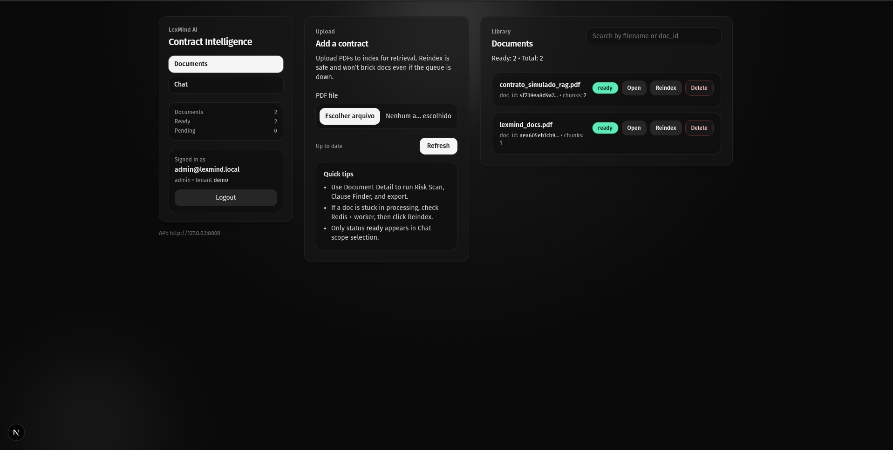
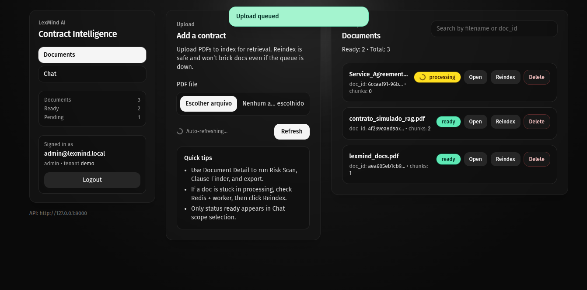
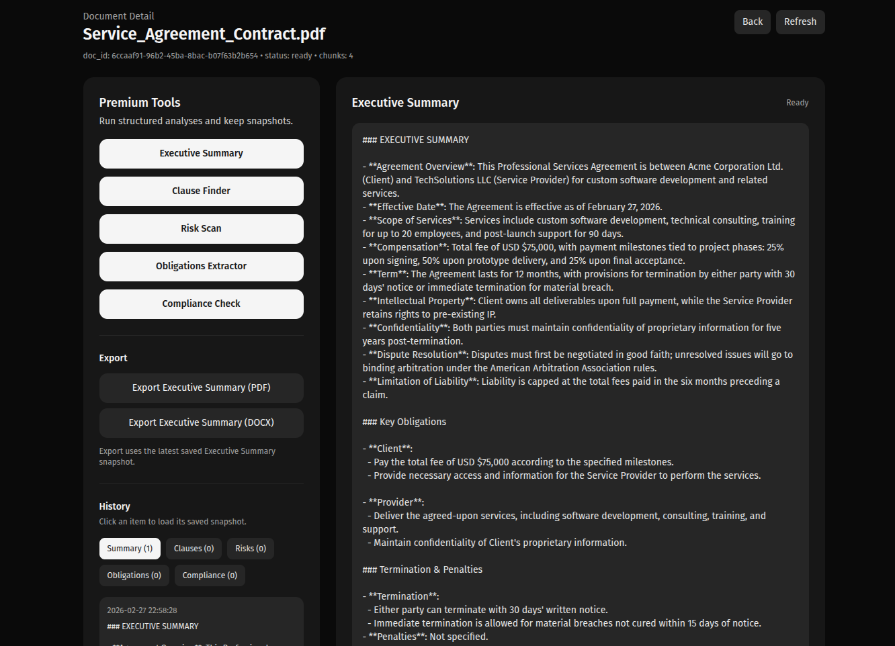
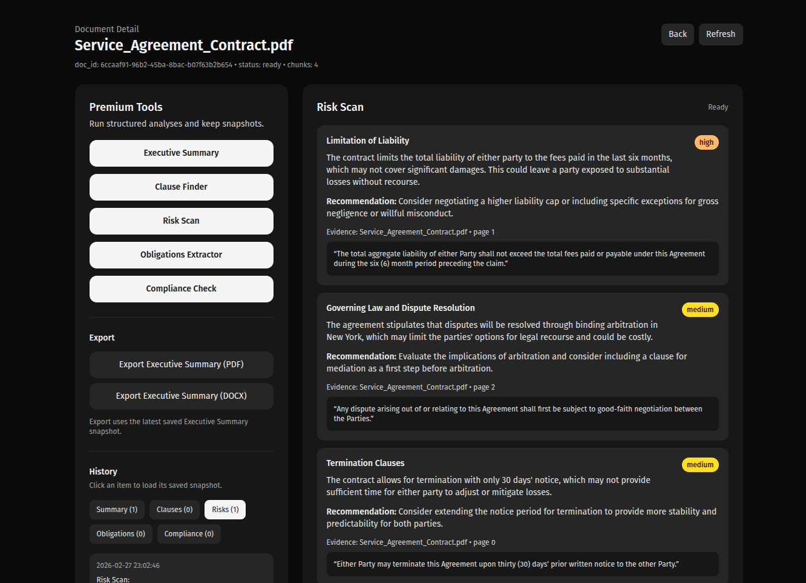
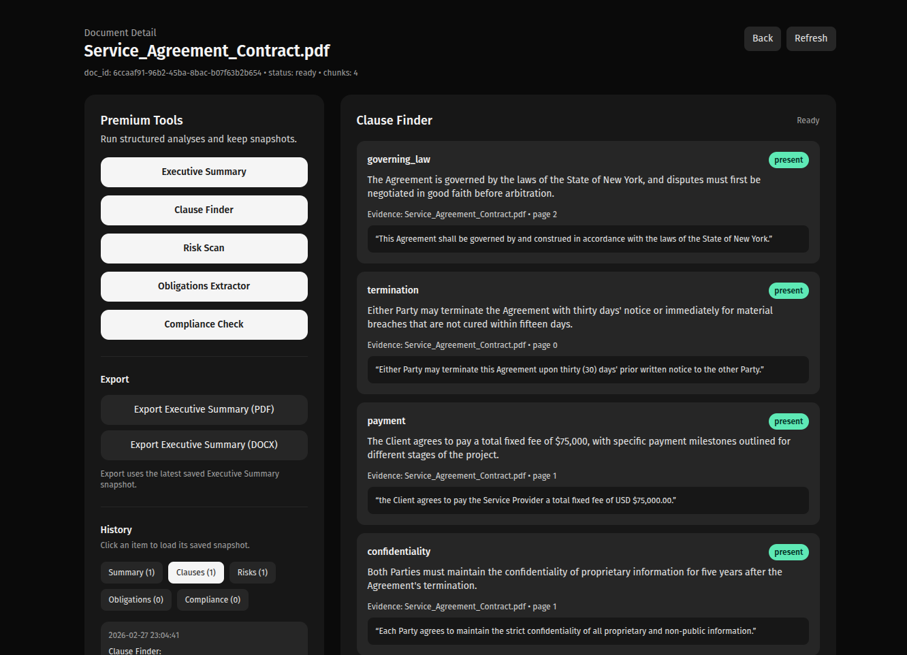
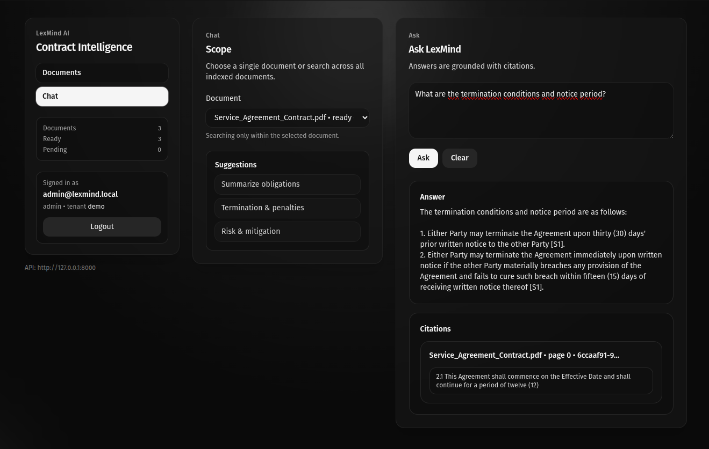

# LexMind AI

**AI-powered contract intelligence platform** built to reduce contract review time, surface legal/commercial risks, and deliver grounded answers with evidence.

> **Portfolio case study:** this repository contains the **product documentation, architecture, screenshots, and demo overview**.
> The source code is currently private.

---

## LexMind AI in One Sentence

LexMind AI is a **contract intelligence system** designed to help firms and businesses review agreements faster, identify risks earlier, and extract high-value insights from contracts using AI with citations.

---

## Why This Matters

Contract review is expensive.

Not only because legal professionals are highly paid, but because the process itself is:

- slow
- repetitive
- cognitively heavy
- difficult to standardize
- hard to scale across teams and clients

Most teams still lose time manually searching for:

- termination clauses
- liability language
- penalties
- confidentiality obligations
- data/privacy terms
- responsibilities of each party
- negotiation risks

LexMind AI was designed to compress that workflow into a faster, more structured, and more trustworthy review experience.

---

## Value Proposition

LexMind AI helps transform contract review from:

**raw PDF → manual reading → fragmented notes → slow decisions**

into:

**upload → process → analyze → validate with citations → export**

The platform is built to generate value in 3 ways:

### 1. Faster Review
Reduce the time needed to understand a contract and identify relevant provisions.

### 2. Better Decision Support
Surface risks, obligations, and key clauses in a format that is easier to act on.

### 3. More Trustworthy AI
Answers are grounded in retrieved sources, with evidence and conservative fallback behavior.

---

## Product Positioning

LexMind AI is not just a "chat with PDF" interface.

It is positioned as a **contract intelligence workflow system**.

The emphasis is on:

- structured analysis
- contract-specific tools
- grounded outputs
- multi-tenant SaaS foundations
- operational usefulness for legal/commercial workflows

This makes it better suited for business value than a generic document chatbot.

---

## High-Level Outcome

LexMind AI was built to answer a simple business question:

> **How do you reduce contract review friction without sacrificing trust?**

The product answers that by combining:

- retrieval-augmented generation (RAG)
- contract-oriented analysis tools
- citations and evidence
- async processing
- observability
- SaaS-ready architecture

---

## Core Features

### Document Management
- PDF upload
- document listing
- document detail page
- status tracking
- reindex flow
- delete flow
- async processing pipeline

### Grounded Q&A
- natural language questions over documents
- citation-based answers
- document scope selection
- hard fallback to **"I don't know."** when evidence is insufficient

### Contract Intelligence Tools
- Executive Summary
- Clause Finder
- Risk Scan
- Obligations Extractor
- Compliance Check
- Snapshots / History
- Export to PDF and DOCX

### SaaS Foundations
- JWT authentication
- refresh token flow
- RBAC (`admin`, `lawyer`, `viewer`)
- tenant isolation
- ACL-aware retrieval

### Reliability & Trust
- request IDs
- structured logging
- metrics
- Sentry-ready monitoring
- anti prompt-injection guardrails
- optional PII redaction hooks

---

## What Problem It Solves

Contract review bottlenecks usually come from one of these issues:

- people spend too much time finding the right clause
- review quality varies depending on who is reading
- stakeholders need summaries, not raw legal text
- AI answers often lack proof
- scaling contract review across tenants/clients becomes messy

LexMind AI addresses those issues by offering a more productized contract-review workflow.

---

## Who This Is For

LexMind AI is relevant for workflows involving:

- legal teams
- procurement teams
- commercial operations
- contract-heavy service businesses
- internal review teams
- legal tech / AI workflow experimentation

It is especially useful where documents are repetitive enough to benefit from structured AI assistance, but important enough that **evidence and trust still matter**.

---

## Business-Oriented Use Cases

Examples of where a system like LexMind AI can create value:

- first-pass contract review
- vendor agreement triage
- service agreement risk identification
- rapid summary generation for stakeholders
- obligation extraction for operations handoff
- contract comparison support
- compliance-oriented checks for privacy/security language

---

## Why This Is More Valuable Than a Generic Chatbot

A generic PDF chatbot can answer questions.

LexMind AI was built to do more than that.

It adds:

- contract-aware chunking
- structured outputs
- specialized legal/commercial tools
- multi-tenant design
- RBAC
- async ingestion
- observability
- trust guardrails
- export/history workflows
- product-oriented UX

That is what turns the project from a simple AI experiment into a portfolio-ready product case.

---

## Architecture Overview

LexMind AI follows a modular SaaS-oriented architecture.

```
┌────────────────────────────────────────────────────────────┐
│                         Frontend UI                        │
│              Next.js + TypeScript + Tailwind               │
│  - dashboard                                               │
│  - document detail                                         │
│  - chat with citations                                     │
│  - tool-driven analysis views                              │
└───────────────────────────────┬────────────────────────────┘
                                │ HTTP
                                ▼
┌────────────────────────────────────────────────────────────┐
│                       FastAPI Backend                      │
│  - auth routes                                             │
│  - document routes                                         │
│  - RAG routes                                              │
│  - analysis routes                                         │
│  - export routes                                           │
│  - metrics endpoint                                        │
│  - observability + guardrails                              │
└───────────────────┬───────────────────────┬────────────────┘
                    │                       │
                    ▼                       ▼
         ┌────────────────────┐   ┌────────────────────────┐
         │    Redis + RQ      │   │   Postgres / Registry  │
         │ async job queue    │   │ document state / data  │
         └─────────┬──────────┘   └────────────────────────┘
                   │
                   ▼
         ┌──────────────────────────────────────────────────┐
         │                   Worker Process                  │
         │  - document ingestion                             │
         │  - background indexing                            │
         │  - reindex jobs                                   │
         └─────────────────────┬────────────────────────────┘
                               │
                               ▼
         ┌──────────────────────────────────────────────────┐
         │                      Qdrant                      │
         │          vector storage + retrieval layer        │
         └─────────────────────┬────────────────────────────┘
                               │
                               ▼
         ┌──────────────────────────────────────────────────┐
         │                   OpenAI Models                  │
         │   - embeddings                                    │
         │   - chat / analysis generation                    │
         └──────────────────────────────────────────────────┘
```

---

## Technical Stack

### Frontend
- Next.js
- TypeScript
- Tailwind CSS

### Backend
- FastAPI
- Python
- LangChain
- OpenAI API

### Data & Processing
- Qdrant
- Redis
- RQ
- PostgreSQL
- Docker

### Observability
- Structured logging
- Prometheus metrics
- Sentry integration

---

## How the System Works

### 1. Upload
A contract PDF is uploaded through the dashboard.

### 2. Async Processing
The backend stores metadata and enqueues a background job, keeping the UI responsive.

### 3. Document Chunking
The worker processes the document using contract-aware chunking to improve retrieval quality.

### 4. Vector Retrieval
Relevant document chunks are embedded and stored in Qdrant for semantic search and retrieval.

### 5. Grounded Generation
When a user asks a question or runs an analysis tool, only retrieved sources are passed to the model.

### 6. Structured Analysis
The platform can produce targeted outputs such as:
- summaries
- clause mapping
- risk analysis
- obligations extraction
- compliance-oriented checks

### 7. Export & History
Results can be stored, revisited, and exported for operational use.

---

## Trust Layer

LexMind AI was built with trust as a design constraint.

**Grounded Answers**
The system is designed to answer using only retrieved sources.

**Hard Fallback**
If there is not enough evidence, the system returns: `"I don't know."`

**Guardrails**
- basic prompt injection detection
- filtering of suspicious instruction-like content inside retrieved chunks
- optional PII redaction support

**Observability**
- request IDs
- HTTP metrics
- token/cost instrumentation
- Sentry-ready monitoring

This makes the project more aligned with real-world product expectations than a simple demo.

---

## Screenshots

### Dashboard / Documents


### Upload / Processing


### Executive Summary


### Risk Scan


### Clause Finder


### Chat with Citations


---

## Demo

[](https://www.youtube.com/watch?v=Y9ACih2kBTU)

---

## Commercial Angle

This project was built with productization in mind.

A future commercial version could be packaged as:
- contract intelligence SaaS
- legal workflow accelerator
- internal AI review assistant
- high-ticket AI implementation for legal/procurement teams

Potential monetization paths include:
- setup + monthly retainer
- internal deployment for teams
- contract review workflow customization
- private hosted version for firms/businesses

Even in its current portfolio form, the project demonstrates the engineering and product thinking needed for that path.

---

## ROI Narrative

A system like LexMind AI creates value if it reduces review time while preserving confidence.

**Example ROI logic:**
- assume contract review takes 45–60 minutes
- if first-pass analysis reduces that to 15–20 minutes
- the time savings compound quickly across recurring workflows

That makes the product especially compelling in environments where:
- contracts are frequent
- professional time is expensive
- consistency matters
- stakeholder turnaround needs to improve

---

## Why the Source Code Is Private

The source code is private because the project may evolve into a commercial product.

This public repository is intended to document:
- product thinking
- architecture
- system design
- features
- engineering decisions
- screenshots
- demo proof

In other words, this repository is a portfolio case study, not an open-source release.

---

## Portfolio Value

This project demonstrates practical work across multiple layers of AI/software engineering:

- RAG systems
- vector search
- async processing
- SaaS foundations
- RBAC and tenant isolation
- product-oriented UI
- trust and observability patterns
- contract-focused AI workflows

It reflects more than API integration. It reflects end-to-end product engineering.

---

## What I Learned

Building LexMind AI helped deepen practical experience in:

- RAG architecture
- product-minded AI engineering
- document intelligence workflows
- async job pipelines
- contract-oriented system design
- observability and reliability
- building software with commercial potential in mind

---

## Current Status

### Completed
- core RAG workflow
- persistent vector database
- async ingestion
- auth + RBAC + multi-tenancy
- contract intelligence tools
- snapshots/history
- PDF/DOCX export
- trust + observability layer
- polished SaaS-style UI

### Deferred for Future Productization
- cloud deployment
- managed object storage
- managed vector infrastructure
- CI/CD
- customer onboarding flow
- commercial rollout

**Project Status:** portfolio-ready, feature-complete for demo purposes, and intentionally paused before full commercialization.

The product is currently being preserved as a strong case study until a future decision is made to evolve it into a production deployment.

---

## Contact

If you'd like to discuss this project, AI systems, software engineering, or potential collaboration:

**Name:** Miguel Ribeiro de Sousa

**Role:** AI & Cloud Specialist / Software Engineer focused on AI systems

**LinkedIn / Portfolio / Contact:** www.linkedin.com/in/miguel-ribeiro-de-sousa
